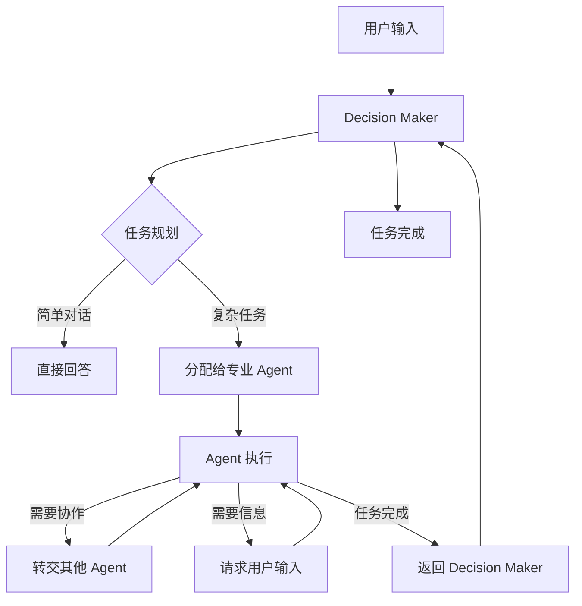

# Live2D Assistant

## 项目简介

**Live2D Assistant** 是一个集成了 Live2D 虚拟形象、AI 智能对话、插件化工具调用能力的多端（Web/Electron 桌面）助手平台。项目支持自定义 Live2D 模型、AI 大语言模型（LLM）接入、TTS 语音合成、MCP 多工具服务器扩展，适合二次元互动、AI 助手、智能桌搭等多种场景。

## 主要特性
- 🎨 **Live2D 虚拟形象**：支持自定义模型、背景、缩放与位置调整。
- 🤖 **AI 智能对话**：通过OpenAi适配接口集成多种 LLM（如 Qwen、Ollama、本地/云端 OpenAI 等），支持上下文多轮对话。
- 🔍 **Web 搜索 (WIP)**：支持通过 Web 搜索获取信息。
- 🗣️ **TTS 语音合成 (WIP)**：可选集成语音播报，支持 CosyVoice、ChatTTS 等。
- 🧩 **MCP 插件扩展**：支持通过 MCP 协议扩展音乐播放、搜索、RAG 检索等工具。
- 🖥️ **多端支持**：Web 端（Vite+Vue3）、桌面端（Electron）一键切换。
- 🛠️ **丰富设置**：支持助手名称、系统提示词、模型参数、背景等多项自定义。

## 目录结构
```
├── live2d-assistant-fe/        # 前端项目（Vue3 + Vite）
│   ├── src/                    # 前端源码
│   │   ├── components/         # Vue 组件
│   │   ├── pages/              # 页面组件
│   │   ├── router/             # 路由配置
│   │   ├── types/              # TypeScript 类型定义
│   │   └── utils/              # 工具函数
│   ├── public/                 # 静态资源
│   ├── package.json            # 前端依赖配置
│   └── vite.config.ts          # Vite 构建配置
├── live2d-assistant-server/    # 后端项目（Python FastAPI）
│   ├── live2d_server/          # 主要服务代码
│   │   ├── server.py           # FastAPI 服务入口
│   │   ├── client.py           # MCP 客户端
│   │   ├── router.py           # API 路由
│   │   ├── rag.py              # RAG 检索功能
│   │   ├── agent/              # AI 代理模块
│   │   ├── search/             # 搜索功能
│   │   └── tools/              # 工具集合
│   ├── main.py                 # 后端启动入口
│   ├── pyproject.toml          # Python 项目配置
│   └── utils/                  # 工具模块
├── electron-live2d/            # Electron 桌面端
│   ├── src/                    # Electron 主进程代码
│   └── ...
├── mcp_servers/                # MCP 服务器插件
│   └── ...
├── Makefile                    # 构建脚本
└── README.md                   # 项目说明
```

## 安装与运行

### 1. 前端 Web 版
```bash
cd live2d-assistant-fe
# 安装依赖
npm install
# 启动开发环境
npm run dev
# 构建生产包
npm run build
```

### 2. 桌面 Electron 版
```bash
cd electron-live2d
npm install
# 启动 Electron 桌面端
npm run start
# 打包桌面应用
npm run package
```

### 3. 后端服务（Python FastAPI）
```bash
cd live2d-assistant-server
# 推荐使用uv
uv venv
uv sync
fastapi run main.py --host 0.0.0.0 --port 8000 --static_path ../live2d-assistant-fe/dist
```

## 配置说明
- **Live2D 模型与背景**：可在前端设置页面自定义模型路径、缩放、偏移、背景图片。
- **AI 助手参数**：支持自定义助手名称、系统提示词、模型类型、API Key、Base URL 等。
- **MCP 工具服务器**：可在 config.json 中添加自定义工具服务器（如音乐播放器、RAG 检索等）。

## 扩展
- 项目支持通过 MCP 协议扩展工具能力，你可以通过 MCP 协议扩展更多工具。

mcp的示例配置如下
```json
[
  {
    "name": "music_player",
    "transport": "sse",
    "url": "http://127.0.0.1:8000/erp-mcp/sse"
  }
]
```
## 依赖说明
- 前端：Vue3、Vite、Ant Design Vue、Element Plus、pixi.js、pixi-live2d-display 等
- 后端：FastAPI、Uvicorn、Pydantic、Ollama、OpenAI、LangChain、Torch、Selenium、BeautifulSoup4 等
- 桌面端：Electron、Express、fs-extra、node-fetch 等

### Agent 系统

项目采用基于 **LangGraph** 的多代理（Multi-Agent）架构，支持动态创建和管理多个专业化 AI 助手，通过协作完成复杂任务。

#### 核心特性

- 🎯 **多代理协作**：支持多个专业化 Agent 协同工作
- 🧠 **智能决策**：Decision Maker 负责任务规划和代理调度
- 🔧 **工具集成**：每个 Agent 可配置专属工具集（MCP、本地文件、Python 代码等）
- ⚡ **异步执行**：基于 LangGraph 的异步状态图执行
- 🔄 **状态管理**：支持中断、恢复和状态持久化
- 📋 **动态配置**：通过配置文件动态定义 Agent 能力

#### Agent 配置

每个 Agent 通过 `AgentConfig` 进行配置：

```python
{
  "name": "research_assistant",           # Agent 名称
  "description": "专业的研究助手，擅长信息收集和分析",
  "tools": [                             # 工具配置
    {
      "source": "mcp",                   # 工具来源：mcp/local_file/python/prebuild
      "mcp_server": "web_search"         # 对应的 MCP 服务器
    },
    {
      "source": "prebuild",              # 预构建工具
      "prebuild_name": "file_manager"    # 工具名称
    }
  ],
  "prompt": "你是一个专业的研究助手...",    # Agent 专属提示词
  "hands_off": ["data_analyst", "writer"] # 可转交的其他 Agent
}
```

#### 工具系统

支持多种工具来源：

| 工具类型 | 描述 | 配置示例 |
|---------|------|----------|
| **MCP** | 通过 MCP 协议获取工具 | `{"source": "mcp", "mcp_server": "web_search"}` |
| **本地文件** | 从 Python 文件加载函数 | `{"source": "local_file", "local_file_path": "./tools/custom.py"}` |
| **Python 代码** | 直接执行 Python 代码 | `{"source": "python", "python_code": "def my_tool(): ..."}` |
| **预构建** | 使用内置工具 | `{"source": "prebuild", "prebuild_name": "calculator"}` |

#### 执行流程



#### 使用示例

1. **创建 Agent 配置**：

```python
research_config = AgentConfig(
    name="researcher",
    description="负责信息收集和研究",
    tools=[
        ToolResouce(source="mcp", mcp_server="web_search"),
        ToolResouce(source="prebuild", prebuild_name="file_reader")
    ],
    prompt="你是一个专业的研究助手，擅长收集和分析信息。",
    hands_off=["analyst", "writer"]
)
```

2. **启动多代理系统**：

```python
agent_system = Agent(
    model_name="qwen2.5",
    llm=ChatOpenAI(...),
    agents=[research_config, analyst_config, writer_config],
    mcp_client=mcp_client
)

graph = await agent_system.build()
```

3. **交互执行**：

```python
# 用户输入任务
result = await graph.ainvoke({
    "messages": [HumanMessage(content="帮我研究一下 AI 的最新发展")],
    "thread_id": "session_001"
})
```

#### 中断与恢复

支持任务中断和恢复机制：

- **主动中断**：Agent 可使用 `request_user_input` 工具请求更多信息
- **状态保存**：使用 MemorySaver 保存执行状态
- **恢复执行**：用户提供信息后自动恢复到中断点

#### 最佳实践

1. **职责分离**：为不同专业领域创建专门的 Agent
2. **工具配置**：根据 Agent 职责配置合适的工具集
3. **协作链路**：通过 `hands_off` 配置合理的 Agent 协作关系
4. **提示词优化**：为每个 Agent 编写专业化的提示词
5. **错误处理**：在工具调用中添加适当的错误处理逻辑

通过这套多代理系统，可以构建出功能强大、专业分工的 AI 助手团队，显著提升复杂任务的处理能力和质量。

## 常见问题

TODO

## 开发计划
- [x] Live2D 模型支持
- [x] 多轮对话支持
- [x] MCP 工具集成
- [x] 可拓展的 multi-agent 支持
- [ ] Streamable mcp 支持
- [ ] 支持 TTS 语音合成
- [x] 支持 Web 搜索 (通过searxng实现，需要在本地部署searxng服务，并监听127.0.0.1:8080端口)
- [ ] 本地知识库支持

## License
MIT 